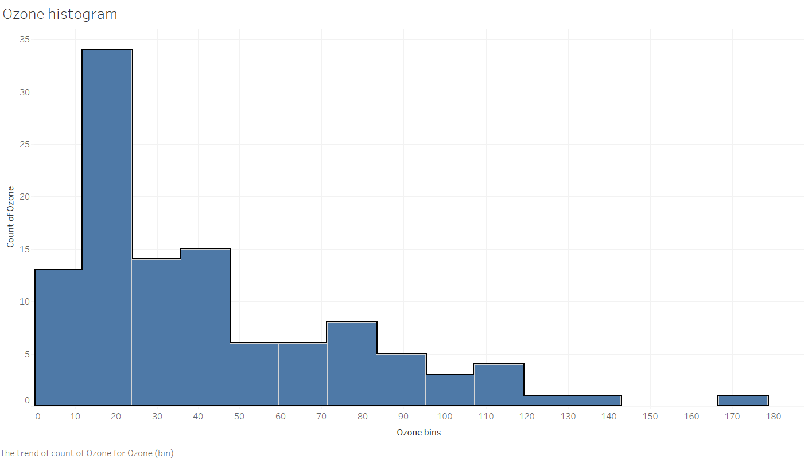
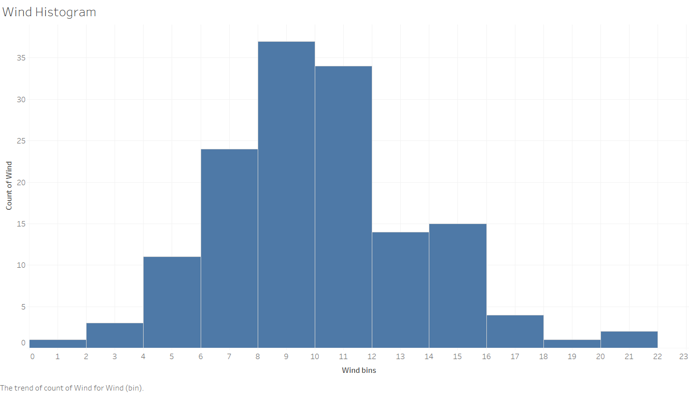
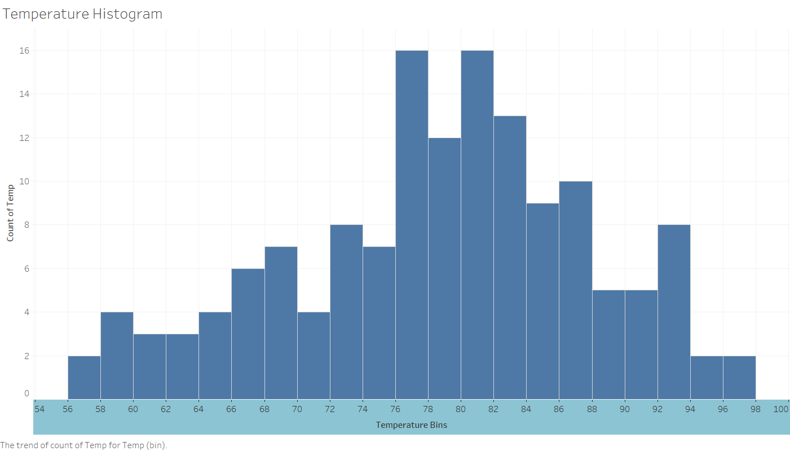
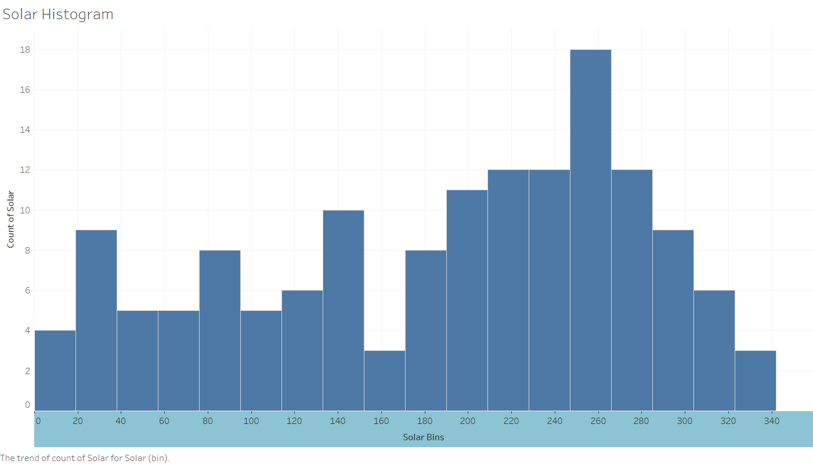
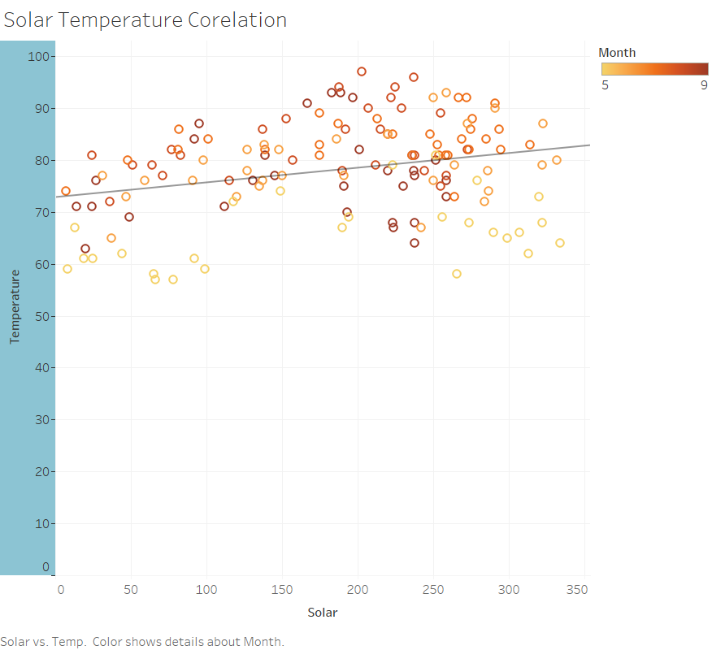
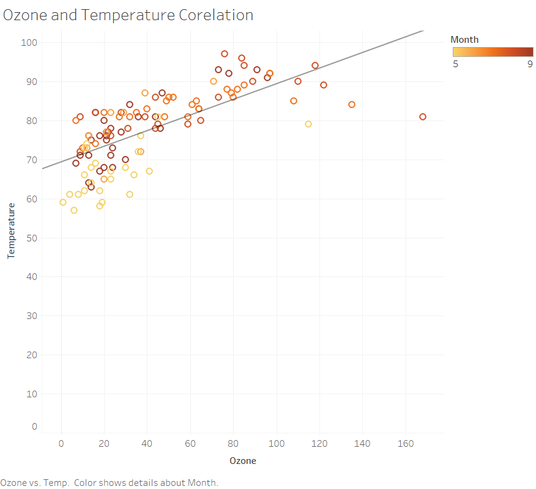
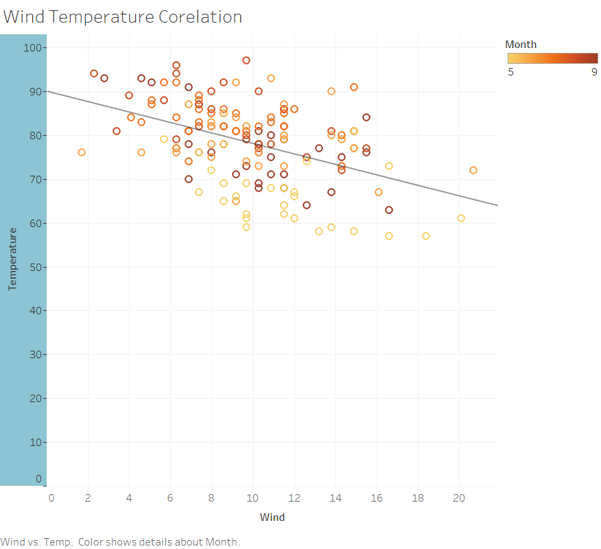

## EDA-of-air-quality-data-using-Tableau
This is an exploratory data analysis of Air quality data of New York using Tableau. Co-relations between the attribute of air like solar, temperature, wind are detected and trends are suggested using different features of tableau. 

Studying the histograms of different attributes of Air quality
 

 

 

 

 

Studying the corelation of attributes and finding attributes

 

 

 
